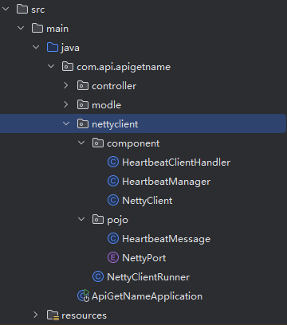

# 心跳包客户端

心跳包客户端基于Netty客户端实现，用于保持API接口的持续可用性监测，帮助您实时监控接口状态。通过定期向网关发送心跳包，确保API服务的正常运行并自动处理异常情况。

## 下载地址

- [网盘分享：api-接口案例.rar](https://pan.baidu.com/s/1DPRcj9A8I2ES_i-JVvOOmg?pwd=aj5j)
- [在 GitHub 查看源码](https://github.com/WuXinYn/API-Heartbeat.git)

## 功能特点

- 基于Netty实现高性能网络通信
- 自动检测接口可用性并发送心跳包
- 支持自定义检测间隔(默认5秒)
- 支持GET和POST请求方式
- 自动重连机制
- 支持异步事件处理
- 接口状态监控与自动故障恢复
- 服务端异常通知系统集成

## 快速开始

### 1. 配置依赖

在 `pom.xml` 文件引入依赖：

```dependency
<dependency>
   <groupId>com.wxy.api</groupId>
   <artifactId>api-client-sdk</artifactId>
   <version>1.0.0-SNAPSHOT</version>
</dependency>

<dependency>
   <groupId>io.netty</groupId>
   <artifactId>netty-all</artifactId>
   <version>4.1.95.Final</version>
</dependency>

<dependency>
   <groupId>org.springframework.retry</groupId>
   <artifactId>spring-retry</artifactId>
   <version>2.0.9</version>
</dependency>
```

### 2. 配置启动类（重试机制）

```java
@SpringBootApplication(exclude = {DataSourceAutoConfiguration.class}) // TODO 示例项目不使用数据库，如果需要配置数据库，请删除（）内的参数
@EnableRetry // 启用重试支持
@Slf4j
public class ApiApplication {

   public static void main(String[] args) {
      SpringApplication.run(Application.class, args);
   }

}
```

```java
@Getter
public enum NettyPort
{
    Gateway_Netty_Server_Port(8100, "Gateway_Netty_Server_Port"), // 心跳服务端端口
    Gateway_Netty_Server_Host(0, "127.0.0.1"); // 心跳服务端地址

    private final int value;

    private final String content;

    NettyPort(int value, String content)
    {
        this.value = value;
        this.content = content;
    }

}
```

```java
/**
 * 自定义心跳消息类型
 */
@Data
@NoArgsConstructor
@AllArgsConstructor
public class HeartbeatMessage
{
    private String clientId;
    private String message;

    @Override
    public String toString() {
        return "HeartbeatMessage{" +
                "clientId='" + clientId + '\'' +
                ", message='" + message + '\'' +
                '}';
    }
}
```

```java
/**
 * 心跳消息处理器
 */
@Slf4j
@Component
public class HeartbeatClientHandler extends ChannelInboundHandlerAdapter
{
    @Override
    public void channelRead(ChannelHandlerContext ctx, Object msg) throws Exception
    {
        log.info("收到服务端响应： {}\n", msg.toString());
    }

    @Override
    public void exceptionCaught(ChannelHandlerContext ctx, Throwable cause) throws Exception
    {
        log.error("客户端异常：{}", cause.getMessage());
        cause.printStackTrace();
        ctx.close();
    }
}
```

```java
@Slf4j
@Component
public class HeartbeatManager
{

    /**
     * TODO 自定义请求IP
     */
    public static final String ip = "localhost";

    /**
     * TODO 自定义请求路径
     */
    public static final String path = "/api/name/user";
    
    /**
     * TODO 项目端口
     */
    public static final int post = 8124;

    /**
     * TODO 自定义请求方式
     */
    public static final String method = "POST";

    private final ConcurrentHashMap<Integer, ScheduledExecutorService> schedulerMap = new ConcurrentHashMap<>();

    public void startHeartbeat(int localPort, Channel channel)
    {
        ScheduledExecutorService scheduler = Executors.newSingleThreadScheduledExecutor();
        scheduler.scheduleAtFixedRate(() -> {
            if (channel != null && channel.isActive()) {
                String msg = "发送心跳包 from the host = http://" + ip + ":" + post + path + "\\" + method;
                log.info(msg);
                channel.writeAndFlush(msg);
            }
            else {
                log.info("Channel for port " + localPort + " is inactive. Stopping heartbeat.");
                stopHeartbeat(localPort);
            }
        }, 0, 5, TimeUnit.SECONDS); //

        schedulerMap.put(localPort, scheduler);
    }

    public void stopHeartbeat(int localPort)
    {
        ScheduledExecutorService scheduler = schedulerMap.remove(localPort);
        if (scheduler != null) {
            scheduler.shutdown();
        }
    }
}
```

```java
/**
 * 心跳客户端
 */
@Component
public class NettyClient {

    @Resource
    private HeartbeatManager heartbeatManager;

    public void start(int localPort, String remoteHost, int remotePort) throws InterruptedException {
        EventLoopGroup group = new NioEventLoopGroup();
        try {
            Bootstrap bootstrap = new Bootstrap();
            bootstrap.group(group)
                    .channel(NioSocketChannel.class)
                    .handler(new ChannelInitializer<Channel>() {
                        @Override
                        protected void initChannel(Channel ch) throws Exception {
                            ch.pipeline().addLast(new HeartbeatClientHandler());
                            ch.pipeline().addLast(new StringDecoder(StandardCharsets.UTF_8)); // 解码器
                            ch.pipeline().addLast(new StringEncoder(StandardCharsets.UTF_8)); // 编码器
                        }
                    });

            // 允许端口快速重用
            bootstrap.option(ChannelOption.SO_REUSEADDR, true);

            // 绑定本地端口
            bootstrap.localAddress(new InetSocketAddress(0)); // 动态分配本地端口

            // 连接远程服务器
            ChannelFuture future = bootstrap.connect(remoteHost, remotePort).sync();
            Channel channel = future.channel();

            // 启动心跳任务
            heartbeatManager.startHeartbeat(localPort, channel);

            // 等待关闭
            channel.closeFuture().sync();
        } finally {
            group.shutdownGracefully();
        }
    }
}
```

```java
/**
 * 心跳客户端启动器
 */
@Component
@Slf4j
public class NettyClientRunner implements CommandLineRunner
{
    @Resource
    private NettyClient nettyClient;

    @Override
    @Retryable(maxAttempts = 3, backoff = @Backoff(delay = 2000)) // 最多尝试 3 次，每次重试之间有 2 秒的延迟
    public void run(String... args) throws Exception {
        // 启动客户端绑定不同本地端口
        new Thread(() -> {
            try {
                int localPost = HeartbeatManager.post;
                nettyClient.start(localPost, NettyPort.Gateway_Netty_Server_Host.getContent(), NettyPort.Gateway_Netty_Server_Port.getValue()); // 自定义客户端
            } catch (InterruptedException e) {
                log.error("启动客户端失败: {}", e.getMessage());
                e.printStackTrace();
            }
        }).start();
    }
}
```

## 配置说明

### 基础配置

| 参数            | 说明            | 默认值 |
|---------------|---------------|-----|
| maxAttempts | 最多重试次数        | 3   |
| @Backoff(delay = )       | 每次重试之间的延迟（毫秒） | 2000 |
| @Component    | 注册为组件         |     |
| @EnableRetry  | 启用重试支持        |     |
| TODO          | 需要用户自行更改      |     |

### 接口配置

| 参数 | 说明 | 示例 |
|------|------|------|
| name | 接口名称 | "获取用户名接口" |
| host | 主机地址 | "localhost" |
| port | 接口端口 | 8124 |
| path | 接口路径 | "/api/name/user" |
| method | 请求方法 | "GET"或"POST" |

## 项目结构示例

```text
src/
├── main/
│   └── java/
│       |── com/
│       |    └── example/
│       |       |── controller/
│       |       |── entity/
│       |       |── service/
│       |       └── nettyclient/
│       |           |── component/
│       |           └── pojo/
│       └── resources/
├── pom.xml
└── README.md
```


## 监控指标

工具会收集以下指标：

1. **接口状态**
   - 是否可访问
   - 通道活跃度
   - 响应数据

2. **性能指标**
   - 心跳响应时间
   - 连接状态
   - 错误次数

## 心跳包机制

### 客户端流程

1. **心跳发送**：每5秒向服务端发送一次心跳包
2. **心跳格式**：`发送心跳包 from the host = http://[ip]:[port][path]\[method]`
3. **响应处理**：接收并记录服务端返回的心跳响应

### 服务端处理

1. **响应处理**：网关服务器接收心跳包并返回"心跳响应"
2. **状态记录**：记录每个通道的最新心跳时间和接口信息
3. **状态恢复**：自动恢复之前异常的接口状态

### 故障检测和恢复机制

1. **异常检测**：服务端使用IdleStateHandler(15, 20, 15)检测通道空闲
2. **故障处理**：当检测到接口异常时，自动将接口状态设置为离线
3. **通知系统**：向管理员发送接口异常通知
4. **自动恢复**：当接口恢复正常后，自动更新接口状态并发送恢复通知

## 使用示例

### 

```text
# 1. 引入相关依赖
# 2. 将nettyclient软件包导入到你项目中(如 项目结构示例), 并在启动类中添加@EnableRetry注解
# 3. 修改相关配置(TODO 标注的地方)
# 4. 启动客户端, 若控制台能成功打印心跳日志, 则说明心跳包配置启动成功
# 5. 若控制台输出以下信息. 说明服务端未启动, 请联系管理员了解详情
2025-03-08 16:02:14.372  INFO 18348 --- [  restartedMain] c.api.apigetname.ApiGetNameApplication   : Started ApiApplication in 1.6 seconds (JVM running for 1.963)
Exception in thread "Thread-8" io.netty.channel.AbstractChannel$AnnotatedConnectException: Connection refused: getsockopt: /127.0.0.1:8100
Caused by: java.net.ConnectException: Connection refused: getsockopt
	at java.base/sun.nio.ch.Net.pollConnect(Native Method)
	at java.base/sun.nio.ch.Net.pollConnectNow(Net.java:672)
	at java.base/sun.nio.ch.SocketChannelImpl.finishConnect(SocketChannelImpl.java:946)
	at io.netty.channel.socket.nio.NioSocketChannel.doFinishConnect(NioSocketChannel.java:337)
	at io.netty.channel.nio.AbstractNioChannel$AbstractNioUnsafe.finishConnect(AbstractNioChannel.java:334)
	at io.netty.channel.nio.NioEventLoop.processSelectedKey(NioEventLoop.java:776)
	at io.netty.channel.nio.NioEventLoop.processSelectedKeysOptimized(NioEventLoop.java:724)
	at io.netty.channel.nio.NioEventLoop.processSelectedKeys(NioEventLoop.java:650)
	at io.netty.channel.nio.NioEventLoop.run(NioEventLoop.java:562)
	at io.netty.util.concurrent.SingleThreadEventExecutor$4.run(SingleThreadEventExecutor.java:997)
	at io.netty.util.internal.ThreadExecutorMap$2.run(ThreadExecutorMap.java:74)
	at io.netty.util.concurrent.FastThreadLocalRunnable.run(FastThreadLocalRunnable.java:30)
	at java.base/java.lang.Thread.run(Thread.java:840)

```

### 自定义监控

```java
import com.api.apigetname.nettyclient.component.NettyClient;
import com.api.apigetname.nettyclient.component.HeartbeatManager;
import org.springframework.context.annotation.Bean;
import org.springframework.context.annotation.Configuration;

@Configuration
public class CustomHeartbeatConfig {
    
    @Bean
    public NettyClient nettyClient() {
        return new NettyClient();
    }
    
    @Bean
    public HeartbeatManager heartbeatManager() {
        return new HeartbeatManager();
    }
    
    // 启动心跳监控
    public void startMonitoring() throws InterruptedException {
        NettyClient client = nettyClient();
        // 启动客户端，参数：本地端口、远程主机、远程端口
        client.start(0, "localhost", 8124);
    }
}
```

## 技术实现

心跳包工具基于Netty框架实现，主要包含以下组件：

### 客户端组件
1. **NettyClient**: 负责建立和维护与服务器的连接
2. **HeartbeatClientHandler**: 处理服务端响应
3. **HeartbeatManager**: 管理心跳包的发送和停止

### 服务端组件
1. **NettyServer**: 服务器端主组件，配置并启动Netty服务器
2. **ExceptionHandlingHandler**: 处理心跳消息和异常情况
3. **ExceptionService**: 提供接口状态管理和故障恢复服务

心跳包每5秒发送一次，服务端设置了15秒读空闲、20秒写空闲和15秒全空闲的超时检测。

## 状态持久化

系统使用Redis进行状态临时存储：
1. **通道映射**: 保存通道ID与接口URL和方法的映射关系
2. **接口状态**: 记录接口的当前状态（alive/killed）
3. **故障恢复**: 当接口恢复时自动更新MySQL数据库中的接口状态

## 常见问题

### 1. 连接超时

- 检查目标服务是否正常运行
- 确认主机地址和端口是否正确
- 检查网络连接是否正常

### 2. 心跳包发送失败

- 检查通道是否活跃
- 确认远程服务是否可访问
- 查看具体的错误响应

### 3. 无法自动重连

- 检查网络环境是否稳定
- 确认服务端是否支持重连
- 查看日志中的具体错误信息

### 4. 接口状态不更新

- 检查Redis服务是否正常
- 确认接口信息是否正确注册
- 检查权限设置是否允许状态修改

## 更新日志

### v1.0.0 (2024-03-08)

- 首次发布
- 基于Netty框架实现
- 支持自定义主机和端口
- 支持定时心跳包发送
- 支持通道异常自动处理
- 集成接口状态监控与自动恢复机制 
